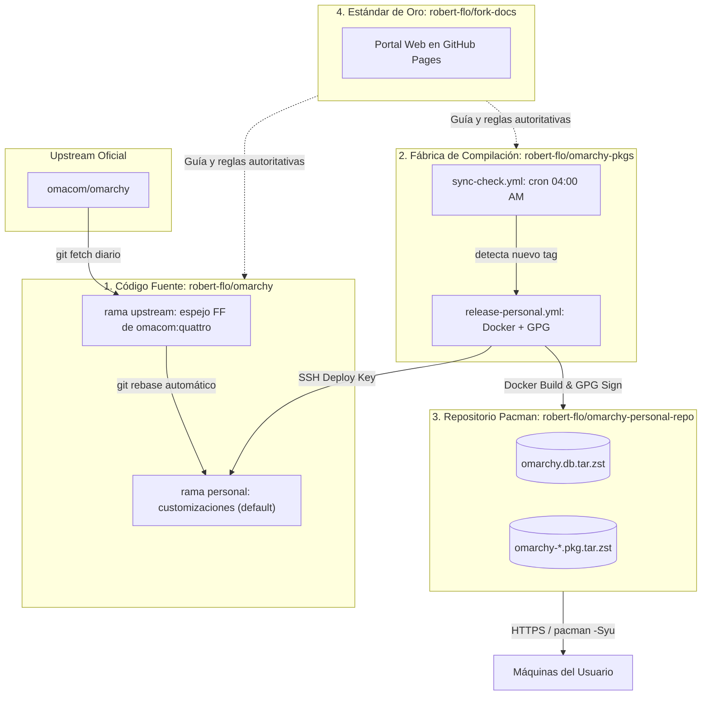

# Topología del Ecosistema

Para lograr una distribución modular, mantenible y desacoplada de upstream, el proyecto se divide estrictamente en **cuatro repositorios independientes**, cada uno con una responsabilidad delimitada y protocolos de comunicación seguros.

---

## 1. Mapa de Repositorios



---

## 2. Los Cuatro Pilares

### Pilar 1: Repositorio de Código Fuente (`robert-flo/omarchy`)
* **Propósito:** Contener el árbol de código fuente del sistema (scripts en `bin/`, configuraciones en `config/`, aplicaciones en `applications/`, recetas en `install/` y migraciones en `migrations/`).
* **Ramas Canónicas:**
  * **`upstream`:** Espejo 1:1 en el fork de la rama **`omacom/omarchy:quattro`**. El fetch sigue viniendo de esa rama de omacom (ellos no la renombraron). En `robert-flo/omarchy` el espejo se llama `upstream` (antes `quattro` local; ADR 0024) y se actualiza exclusivamente por *Fast-Forward* para garantizar que nunca diverga ni genere commits sintéticos.
  * **`personal`:** Rama activa y **rama por defecto de GitHub** donde residen las personalizaciones. Vive siempre rebaseada sobre la punta de `upstream`.
* **Seguridad:** Autoriza la clave SSH Deploy Key `omarchy-source-sync` con permisos de escritura para permitir que la fábrica de empaquetado actualice las ramas de forma desatendida.

### Pilar 2: Fábrica de Compilación (`robert-flo/omarchy-pkgs`)
* **Propósito:** Orquestar la integración continua, detección de versiones y construcción containerizada de paquetes de Arch Linux.
* **Componentes:**
  * **Recetas PKGBUILD:** Fichas de empaquetado del par `omarchy` y `omarchy-settings`, además de paquetes personales adicionales como `hola-mundo`.
  * **Contenedores Docker:** Entornos efímeros y puros de Arch Linux donde se ejecutan `makepkg` y `repo-add` sin contaminar el host.
  * **Workflows de GitHub Actions:**
    * `sync-check.yml`: Cron a las 04:00 AM que compara tags upstream.
    * `release-personal.yml`: Pipeline que sincroniza ramas, compila con Docker, firma con GPG y publica en el CDN.
* **Ramas:** El default de GitHub es **`master`** (copias de registro de `release-personal.yml` y `sync-check.yml`). El pin del par lockstep y las recetas `"personal": true` viven en **`personal`**.
* **Excepción al [ADR 0024](https://github.com/robert-flo/fleet/blob/main/docs/adr/0024-personal-y-upstream-en-cada-fork.md) de fleet:** Este fork **no** recibe el modelo por defecto (`personal` como rama default, espejo `upstream` de `omacom/omarchy-pkgs:master`, ni el caller nocturno de sync de fleet). `personal` aquí es un pin/release **curado**; rebasearla sobre `omacom/master` choca con el pin y con el CI del fork, y un *force-with-lease* nocturno competiría con `release-personal.yml`. El Fast-Forward/rebase ocurre en `robert-flo/omarchy` (`upstream` ← `omacom:quattro`) desde `release-personal.yml`; la cadencia de pkgs compara tags de `omacom/omarchy` vía `sync-check.yml`. Evidencia: [robert-flo/omarchy-pkgs#8](https://github.com/robert-flo/omarchy-pkgs/issues/8).
* **Secretos:** Custodia `GPG_PRIVATE_KEY` (clave privada para firmar) y `SSH_OMARCHY_SOURCE_KEY` (deploy key para hacer push al repositorio fuente).

### Pilar 3: CDN de Distribución Pacman (`robert-flo/omarchy-personal-repo`)
* **Propósito:** Servidor de paquetes binarios consumible directamente por `pacman`.
* **Alojamiento:** Servido estáticamente mediante GitHub Pages en la rama `gh-pages`.
* **Estructura de Directorios:**
  ```text
  stable/
  └── x86_64/
      ├── omarchy.db.tar.zst        # Base de datos del repositorio
      ├── omarchy.db.tar.zst.sig    # Firma GPG de la base de datos
      ├── omarchy.files.tar.zst     # Índice de archivos
      ├── omarchy-4.0.4-99-any.pkg.tar.zst
      ├── omarchy-4.0.4-99-any.pkg.tar.zst.sig
      ├── omarchy-settings-4.0.4-99-any.pkg.tar.zst
      └── omarchy-settings-4.0.4-99-any.pkg.tar.zst.sig
  keys/
  └── omarchy-personal-repo.pub.asc  # Clave pública para clientes
  ```

### Pilar 4: Portal de Documentación Canónica (`robert-flo/fork-docs`)
* **Propósito:** Este sitio web. Es la **única fuente de la verdad** y el estándar arquitectónico.
* **Rol:** Describe formalmente cómo opera el sistema, almacena los ADRs, define la Matriz de Decisión y guía tanto a agentes de IA como a desarrolladores humanos.
