# Matriz de Decisión Canónica

> **Regla de Oro de Arquitectura:**  
> Ante cualquier requerimiento de agregar una nueva funcionalidad, configuración, acceso directo o script al fork, **el agente o desarrollador DEBE consultar esta Matriz de Decisión**.  
> Si una propuesta de cambio no encaja en ninguna fila, es una señal inequívoca de que se está intentando crear un mecanismo paralelo no soportado por upstream. En tal caso, **detenerse y replantear**.

---

## 1. La Matriz de Clasificación de Cambios

| Tipo de cambio | Dónde va en el fork (`robert-flo/omarchy`) | Dónde se instala en el sistema | Paquete responsable | Validación en DEV | Cómo viaja a otras máquinas |
| :--- | :--- | :--- | :--- | :--- | :--- |
| **Config de usuario** (kitty, hyprland, foot, shell…) | `config/<app>/` | `~/.config/<app>/` (semilla en `/etc/skel/` y resync en `/usr/share/omarchy/config/`) | `omarchy-settings` | `omarchy dev pkg-test` + `omarchy refresh config <relpath>` | `omarchy update` |
| **Webapp / launcher** | `applications/*.desktop` + `applications/icons/` | `~/.local/share/applications/` (e iconos hicolor) | `omarchy-settings` | `omarchy dev pkg-test` + `omarchy refresh-applications` | `omarchy update` |
| **Ejecutable propio** (`omarchy-*`) | `bin/omarchy-*` (con metadatos `# omarchy:summary=…`) | `/usr/bin/` | `omarchy` | `omarchy dev pkg-test` | `omarchy update` |
| **Wrapper de terceros** (mise, npm, oficiales) | `install/user/*.sh` + líneas `omarchy-mise-install` | `~/.local/bin/` (idempotente) | `omarchy-settings` | `omarchy refresh-applications` | `omarchy update` |
| **Set de paquetes del sistema** | `install/omarchy-base.packages` / `omarchy-other.packages` | Instalado por pacman | `omarchy-settings` | `omarchy reinstall pkgs` | `omarchy update` |
| **Script de provisioning / migración** | `migrations/<timestamp>.sh` (estrictamente idempotente) | `/usr/share/omarchy/migrations/` | `omarchy` | `omarchy dev pkg-test` + ejecutar la migración | `omarchy update` (ejecuta `omarchy-migrate` automáticamente) |

---

## 2. Los Dos y Solo Dos Escenarios Operativos

Todo el modelo de trabajo en el fork se divide en dos escenarios mutuamente excluyentes:

```mermaid
graph TD
    subgraph Escenario1 ["Escenario DEV (Validar en local)"]
        D1[Editar código fuente en el fork] --> D2[omarchy dev pkg-test]
        D2 --> D3[Instala paquetes dev.SHA localmente]
        D3 --> D4[omarchy refresh ... para probar en vivo]
        D4 --> D5[Validación exitosa: la máquina dev queda en línea -dev]
    end

    subgraph Escenario2 ["Escenario MÁQUINAS (Distribuir a producción)"]
        M1[git commit & push a rama personal] --> M2[GitHub Actions release-personal.yml]
        M2 --> M3[Compilación en Docker Arch Linux y firma GPG]
        M3 --> M4[Publicación de paquetes sombreados en omarchy-personal-repo]
        M4 --> M5[omarchy update en cada computadora cliente]
    end
```

### Reglas Clave:
1. **`omarchy dev pkg-test` es exclusivo de desarrollo local:**  
   Construye e instala paquetes provisionales marcados como `dev.<commit-sha>` directamente desde el checkout de trabajo. **Nunca se ejecuta en máquinas cliente de producción**.
2. **`omarchy update` es el único gatillo de distribución:**  
   Para que un cambio llegue a tus otras computadoras o a usuarios del fork, debe publicarse a través de la Action de empaquetado y consumirse vía pacman.

---

## 3. Estado de los Mecanismos (Qué vive y qué queda derogado)

* **VIVO:** La estructura nativa de Omarchy (`config/`, `applications/`, `bin/`, `install/`, `migrations/`).
* **DEROGADO:** Scripts sueltos descargados por `curl` por máquina (como los POCs iniciales de bootstrap de launchers). Todo wrapper externo debe materializarse a través de `install/user/*.sh` siguiendo el patrón de `omarchy-mise-install`.
* **DESCARTADO:** El sistema de plugins de Omarchy (`~/.config/omarchy/plugins/`). Ese subsistema está reservado exclusivamente para widgets gráficos de la barra Quickshell; **no** es un mecanismo para binarios ni configuraciones del sistema operativo.
