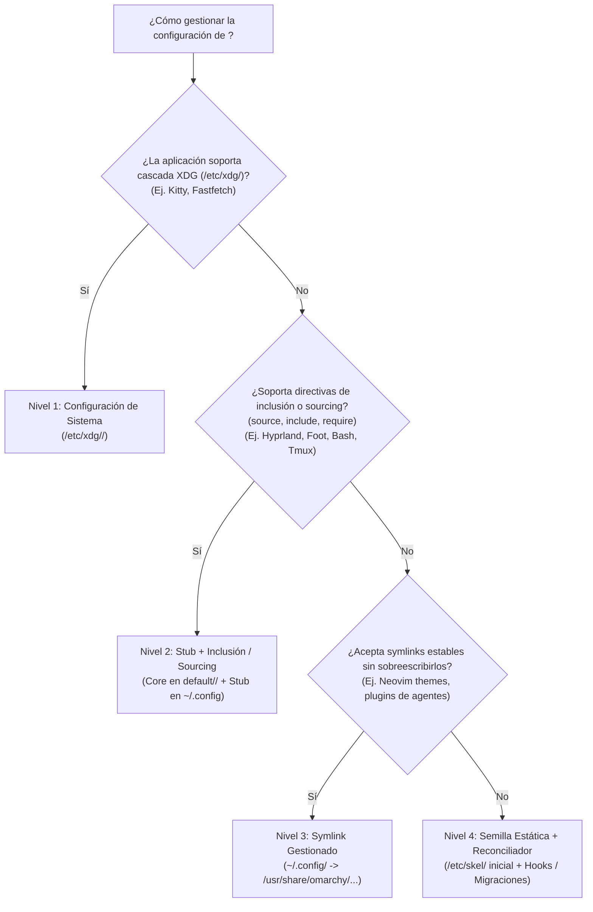

# Matriz de Decisión Canónica

> **Regla de Oro de Arquitectura:**  
> Ante cualquier requerimiento de agregar una nueva funcionalidad, configuración, acceso directo o script al fork, **el agente o desarrollador DEBE consultar esta Matriz de Decisión**.  
> Si una propuesta de cambio no encaja en ninguna fila, es una señal inequívoca de que se está intentando crear un mecanismo paralelo no soportado por upstream. En tal caso, **detenerse y replantear**.

---

## 1. La Matriz de Clasificación de Cambios

| Tipo de cambio | Dónde va en el fork (`robert-flo/omarchy`) | Dónde se instala en el sistema | Paquete responsable | Validación en DEV | Cómo viaja a otras máquinas |
| :--- | :--- | :--- | :--- | :--- | :--- |
| **Configuración de aplicación** | Según el Árbol de 4 Niveles (ver §2) | `/etc/xdg/` o `/usr/share/omarchy/default/` o `~/.config/` | `omarchy-settings` | `omarchy dev link` o `omarchy dev pkg-test` | `omarchy update` |
| **Webapp / launcher** | `applications/*.desktop` + `applications/icons/` | `~/.local/share/applications/` (e iconos hicolor) | `omarchy-settings` | `omarchy dev pkg-test` + `omarchy refresh-applications` | `omarchy update` |
| **Ejecutable propio** (`omarchy-*`) | `bin/omarchy-*` (con metadatos `# omarchy:summary=…`) | `/usr/bin/` | `omarchy` | `omarchy dev link` / `omarchy dev pkg-test` | `omarchy update` |
| **Wrapper de terceros** (mise, npm, oficiales) | `install/user/*.sh` + líneas `omarchy-mise-install` | `~/.local/bin/` (idempotente) | `omarchy-settings` | `omarchy refresh-applications` | `omarchy update` |
| **Set de paquetes del sistema** | Arch: `install/omarchy-base.packages` (ej. `meld`). AUR: `install/omarchy-aur.packages` (ej. `elio-bin`). No `omarchy-other.packages` | En el sistema, solo si falta: pacman (Arch) o yay (AUR), vía `omarchy-pkg-sync` | `omarchy` | `omarchy dev pkg-test` en gracie (corre `omarchy-pkg-sync`; no `omarchy update`) | Tras [W7](/fork-docs/operations/00-recetas-rapidas/), `omarchy update`: `--repos` con sudo vivo, `--aur` en la fase fría |
| **Script de provisioning / migración** | `migrations/<timestamp>.sh` (estrictamente idempotente) | `/usr/share/omarchy/migrations/` | `omarchy` | `omarchy dev pkg-test` + ejecutar la migración | `omarchy update` (ejecuta `omarchy-migrate` automáticamente) |
| **Hook de ciclo de vida / reconciliación** | `install/user/first-run/*.hook` o `~/.config/omarchy/hooks/<event>.d/` | `~/.config/omarchy/hooks/<event>.d/` | `omarchy-settings` (seed) / dotfiles | `omarchy-hook <event>` | `omarchy update` (dispara `post-update`) |

---

## 2. Árbol de Decisión de Configuraciones de Usuario (4 Niveles)

Existe una falsa asunción común: creer que empaquetar archivos en `config/<app>/` hace que `omarchy update` los actualice en los directorios `$HOME` de los usuarios existentes. **Esto es falso.** En Linux, `pacman` jamás sobreescribe archivos dentro de `$HOME`, y `/etc/skel/` únicamente siembra cuentas nuevas durante `useradd`.

Para desplegar configuraciones y actualizaciones de forma confiable sin pisotear personalizaciones del usuario ni requerir migraciones destructivas continuas, toda configuración de aplicación debe encajar en uno de los siguientes **4 niveles según las capacidades nativas de la aplicación**:

### Detalle de los 4 Niveles

#### Nivel 1: Configuración a Nivel de Sistema (`/etc/xdg/<app>/`)
* **Capacidad requerida:** La aplicación cumple la especificación XDG y lee `/etc/xdg/<app>/config` como base del sistema antes de leer `$HOME/.config/<app>/config`.
* **Dónde vive en el repo:** `etc/xdg/<app>/` (empaquetado en `/etc/xdg/<app>/` vía `omarchy-settings`).
* **Mecanismo:** La distribución gobierna los defaults globales en `/etc/xdg/`. El usuario no necesita ningún archivo en `$HOME` a menos que desee agregar overrides locales.
* **Actualización en la flota:** Automática con cada `pacman -Syu` / `omarchy update`. Cero fricción y cero modificaciones a `$HOME`.
* **Ejemplos canónicos:** `kitty` (`/etc/xdg/kitty/kitty.conf`), `fastfetch` (`/etc/xdg/fastfetch/config.jsonc`).

#### Nivel 2: Stub de Usuario + Inclusión / Sourcing (`default/<app>/`)
* **Capacidad requerida:** La aplicación no lee `/etc/xdg/` o prioriza `$HOME/.config/`, pero soporta directivas de inclusión (`source = ...`, `include = ...`, `@import`, `source-file`, etc.).
* **Dónde vive en el repo:**
  * Core de la flota: `default/<app>/` (instalado en `/usr/share/omarchy/default/<app>/` o generado dinámicamente en `~/.local/state/omarchy/current/`).
  * Stub inicial: `/etc/skel/.config/<app>/` (o migración de inicialización única para usuarios existentes).
* **Mecanismo:** El archivo de usuario en `~/.config/<app>/` es un *stub* mínimo que hace `source` del archivo central de la flota y reserva espacio para personalizaciones del usuario.
* **Actualización en la flota:** La flota modifica el archivo central en `default/<app>/`. Cuando el usuario actualiza mediante `omarchy update`, `pacman` actualiza el archivo central y todos los stubs heredan la nueva configuración de inmediato sin alterar los overrides locales.
* **Ejemplos canónicos:** `hyprland` (`source = ~/.local/state/omarchy/current/theme/hyprland.conf`), `foot` (`include=~/.local/state/omarchy/current/theme/foot.ini`), `bash` (`default/bash/env-bootstrap`).

##### Patrón Arquitectónico: Submódulo Anexo (Prevención de Conflictos de Rebase)
Al extender o modificar configuraciones centrales gobernadas por upstream dentro del Nivel 2 (como Hyprland en `default/hypr/`):
* **Antipatrón Prohibido:** Editar o comentar líneas directamente en los archivos originales provistos por upstream (por ejemplo, `default/hypr/looknfeel.lua` o `default/hypr/bindings/tiling.lua`). Cualquier diff invasivo en estos archivos provoca colisiones y conflictos de rebase en git durante el cron desatendido de sincronización de las 04:00 AM (`sync-check.yml`).
* **Patrón Canónico de Submódulo Anexo:**
  1. **Crear un módulo propio nuevo e independiente:** Ubicar la personalización en un archivo dedicado (por ejemplo, `default/hypr/scrolling.lua`) conteniendo exclusivamente la configuración, opciones y enlaces de teclas (`o.rebind`/`o.bind`) de la nueva funcionalidad.
  2. **Invocación única en el orquestador:** Agregar únicamente un `require` al final del archivo orquestador principal (por ejemplo, `require("default.hypr.scrolling")` al pie de `default/hypr/omarchy.lua`).
  3. **Diff cero con upstream:** Los archivos originales de upstream permanecen 100% idénticos a su versión original (`looknfeel.lua`, `tiling.lua`, etc.).
  4. **Impacto en el pipeline de sincronización:** Cuando upstream publica cambios o refactorizaciones, git aplica los commits limpios durante el rebase sin fricción. La única línea anexa al final del orquestador se preserva sin generar conflictos manuales.

#### Nivel 3: Enlace Simbólico Gestionado (Symlink)
* **Capacidad requerida:** La aplicación requiere un archivo o carpeta en `$HOME/.config/<app>/`, no soporta directivas `source`/`include`, pero no sobreescribe destructivamente los symlinks (solo lee de ellos).
* **Dónde vive en el repo:** El archivo o directorio maestro reside en el paquete (`/usr/share/omarchy/...`). El symlink en `$HOME` se materializa durante `omarchy-provision-user` o una migración puntual.
* **Mecanismo:** `~/.config/<app>/...` apunta simbólicamente a `/usr/share/omarchy/...` o a `~/.local/state/omarchy/current/...`.
* **Actualización en la flota:** `omarchy update` reemplaza el contenido en `/usr/share/omarchy/`. El enlace simbólico del usuario refleja los cambios al instante. Si el usuario decide reemplazar el symlink con un archivo real, voluntariamente toma el ownership completo (opt-out de la flota).
* **Ejemplos canónicos:** Temas de Neovim (`~/.config/nvim/lua/plugins/theme.lua` apuntando a `~/.local/state/omarchy/current/theme/neovim.lua`), skills de agentes (`~/.agents/skills/*` apuntando a `/usr/share/omarchy/default/agents/skills/*`).

#### Nivel 4: Semilla Estática (`/etc/skel/`) + Reconciliador Continuo
* **Capacidad requerida:** Aplicaciones donde el archivo de configuración es monolítico, la herramienta sobreescribe el archivo borrando includes/comentarios (ej. GUI apps que escriben JSON/INI), o herramientas sin capacidad de herencia.
* **Dónde vive en el repo:**
  * Semilla inicial: `default/<app>/` copiado a `/etc/skel/.config/<app>/` por `omarchy-settings`.
  * Reconciliador continuo: script hook en `~/.config/omarchy/hooks/post-update.d/reconcile-<app>.sh` o repo personal de dotfiles.
  * Reparación puntual: `migrations/<timestamp>.sh`.
* **Mecanismo:** Nuevos usuarios reciben la semilla desde `/etc/skel/`. Para usuarios existentes, la flota **NO** toca el archivo en `$HOME` durante un update regular. Cualquier actualización continua debe ser procesada por un hook reconciliador (ej. manipulando llaves con `jq` de forma no destructiva) o delegada al repositorio personal de dotfiles del usuario.
* **Actualización en la flota:** Vía hooks en `post-update.d/` o migraciones idempotentes de un solo uso.

---

## 3. Ownership de Configuraciones: Flota (Core) vs. Usuario Local (Overrides)

El principio rector del fork es la separación estricta entre la **autoridad de la flota** y la **autonomía del usuario local**:

| Dimensión | Dominio de la Flota (Core) | Dominio del Usuario Local (Overrides) |
| :--- | :--- | :--- |
| **Responsabilidad** | Robert-flo / Mantenedores de la distro | Usuario de la máquina / Máquina individual |
| **Ubicación típica** | `/etc/xdg/`, `/usr/share/omarchy/`, `/usr/bin/` | `~/.config/<app>/`, `~/.local/bin/`, variables de entorno locales |
| **Ciclo de vida** | Se versiona en Git, se empaqueta en `omarchy-settings` / `omarchy` y viaja por `omarchy update` | Se conserva intacto a través de actualizaciones del sistema |
| **Capacidad de edición** | No editable a mano en máquinas cliente (inmutable fuera de empaquetado) | Completamente modificable por el usuario local |
| **Manejo de conflictos** | La flota nunca sobreescribe archivos de usuario en `$HOME` directamente | El usuario extiende los defaults importados o redefine variables |

### Aclaración Canónica sobre `omarchy update`
`omarchy update` ejecuta de manera secuencial y segura:
1. `pacman -Syu` (actualiza paquetes en rutas de sistema: `/usr/`, `/etc/`, etc.).
2. `omarchy-migrate` (ejecuta scripts pendientes en `/usr/share/omarchy/migrations/` registrando estado por usuario en `~/.local/state/omarchy/migrations/`).
3. `omarchy-hook post-update` (ejecuta ganchos de reconciliación en `~/.config/omarchy/hooks/post-update.d/`).

**`omarchy update` jamás barre ni reemplaza recursivamente el contenido de `$HOME`**. Todo intento de sincronizar configuraciones asumiendo que `omarchy update` actualiza `$HOME` directamente es un error de diseño que viola este modelo.

---

## 4. Los Dos y Solo Dos Escenarios Operativos

Todo el modelo de trabajo en el fork se divide en dos escenarios mutuamente excluyentes:

```mermaid
graph TD
    subgraph Escenario1 ["Escenario DEV (Validar en local)"]
        D1["Editar código fuente en el fork"] --> D2["omarchy dev link o pkg-test"]
        D2 --> D3["Iteración en caliente o paquetes dev.SHA"]
        D3 --> D4["omarchy refresh ... para probar en vivo"]
        D4 --> D5["Validación exitosa: la máquina dev queda en línea -dev"]
    end

    subgraph Escenario2 ["Escenario MÁQUINAS (Distribuir a producción)"]
        M1["git commit & push a rama personal"] --> M2["GitHub Actions release-personal.yml"]
        M2 --> M3["Compilación en Docker Arch Linux y firma GPG"]
        M3 --> M4["Publicación de paquetes sombreados en omarchy-personal-repo"]
        M4 --> M5["omarchy update en cada computadora cliente"]
    end
```

### Reglas Clave:
1. **Iteración en DEV es exclusiva de desarrollo local:**  
   Se utiliza `omarchy dev link` para iterar en caliente sobre scripts, temas y configuraciones, o `omarchy dev pkg-test` para validar empaquetado e instalar paquetes provisionales `dev.<commit-sha>`. **Nunca se ejecutan en máquinas cliente de producción**.
2. **`omarchy update` es el único gatillo de distribución:**  
   Para que un cambio llegue a tus otras computadoras o a usuarios del fork, debe publicarse a través de la Action de empaquetado y consumirse vía pacman.

---

## 5. Estado de los Mecanismos (Qué vive y qué queda derogado)

* **VIVO:** La estructura nativa de Omarchy:
  * Sistema: `/etc/xdg/` y `/etc/omarchy.conf`.
  * Fuentes base: `default/<app>/`, `themes/`, `applications/`, `bin/`.
  * Reconciliación continua: `~/.config/omarchy/hooks/<event>.d/`.
  * Migraciones puntuales: `migrations/<timestamp>.sh`.
* **DEROGADO:** Scripts sueltos descargados por `curl` por máquina (como los POCs iniciales de bootstrap de launchers). Todo wrapper externo debe materializarse a través de `install/user/*.sh` siguiendo el patrón de `omarchy-mise-install`.
* **DESCARTADO:** El sistema de plugins de Omarchy (`~/.config/omarchy/plugins/`). Ese subsistema está reservado exclusivamente para widgets gráficos de la barra Quickshell; **no** es un mecanismo para binarios ni configuraciones del sistema operativo.
