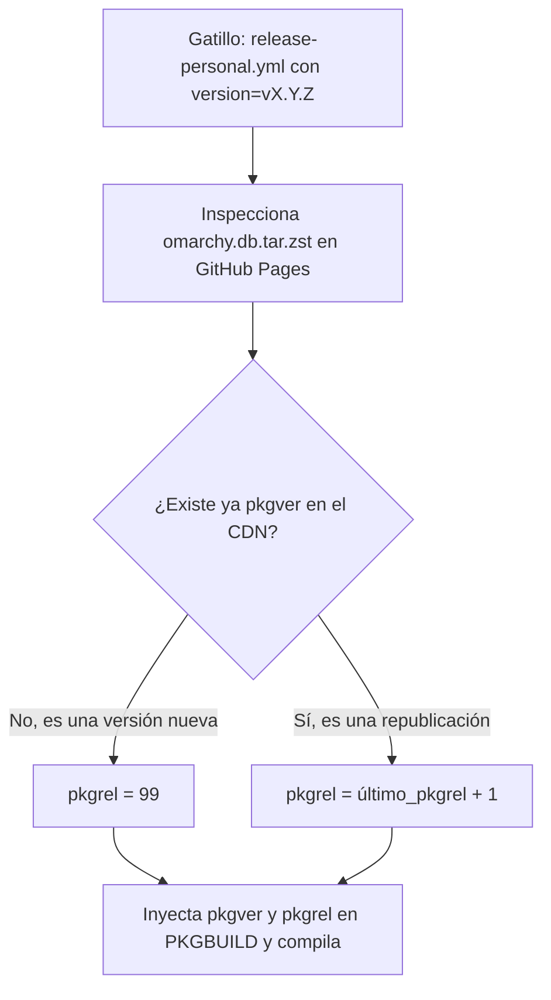

# Sombreado & Versionado (pkgrel 99)

Uno de los mayores desafíos al personalizar distribuciones Linux sobre repositorios oficiales es evitar que las actualizaciones oficiales sobrescriban tus cambios, sin tener que renombrar los paquetes (lo cual rompería dependencias cruzadas con el resto del sistema).

Para resolver esto de forma limpia, el proyecto implementa la técnica de **Sombreado Parcial de Paquetes** (*Package Shading*), formalizada en los **ADR-003** y **ADR-004**.

---

## 1. El Concepto de Sombreado

En lugar de crear paquetes con nombres alternativos como `omarchy-personal` o `omarchy-custom`, mantenemos **exactamente el mismo nombre de paquete que upstream**:

* `omarchy`
* `omarchy-settings`

De este modo:
1. Todos los scripts del sistema que hacen llamadas o comprobaciones sobre estos paquetes siguen funcionando al 100%.
2. Pacman trata nuestros paquetes como la versión más reciente del mismo componente oficial y no requiere desinstalaciones ni reemplazos forzados.

---

## 2. La Regla del `pkgrel` Alto (99+)

Arch Linux evalúa la prioridad de un paquete basándose en su tupla de versión: `epoch:pkgver-pkgrel`.

| Componente | Upstream Oficial | Nuestro Fork Personal |
| :--- | :--- | :--- |
| **`pkgver`** | `4.0.4` | `4.0.4` *(idéntico al release base)* |
| **`pkgrel`** | `1` | **`99`** *(sombreado personal)* |
| **Versión final** | `4.0.4-1` | **`4.0.4-99`** |

Cuando `pacman -Syu` compara versiones con la utilidad estándar `vercmp`:

```bash
vercmp 4.0.4-99 4.0.4-1
# Resultado: 1 (4.0.4-99 es estrictamente mayor que 4.0.4-1)
```

Pacman concluye que la versión disponible en nuestro repositorio `[omarchy-personal]` es superior a la del repositorio oficial de Omarchy, garantizando que **`omarchy update` siempre instale y conserve nuestras personalizaciones**.

---

## 3. Derivación Automática en CI/CD

El mantenedor o el sistema de cadencia **no necesita calcular manualmente el número de `pkgrel`**. El pipeline de empaquetado [`release-personal.yml`](https://github.com/robert-flo/omarchy-pkgs/blob/personal/.github/workflows/release-personal.yml) inspecciona dinámicamente la base de datos binaria antes de compilar:



* **Nuevo Release Upstream (ej. `v4.0.5`):**  
  La Action detecta que `4.0.5` no existe en nuestro CDN. Asigna automáticamente `pkgrel = 99` (generando `omarchy-4.0.5-99`).
* **Republicación de Personalizaciones (mismo `v4.0.4`):**  
  Si modificamos un archivo de configuración sin que upstream haya cambiado de versión, la Action detecta que la última versión en el CDN fue `4.0.4-99` y compila automáticamente `4.0.4-100`.

---

## 4. Prioridad de Repositorios en `pacman.conf`

Para consolidar el sombreado, la sección del repositorio personal debe ubicarse al inicio de `/etc/pacman.conf`:

```ini
# /etc/pacman.conf
[omarchy-personal]
SigLevel = Required DatabaseOptional
Server = https://robert-flo.github.io/omarchy-personal-repo/stable/$arch

[omarchy] # Repositorio oficial upstream (queda sombreado por el nuestro)
...

[core]
...
```

Pacman evalúa los repositorios en el orden en que aparecen en el archivo de configuración. Al colocar `[omarchy-personal]` en primer lugar, pacman resuelve los metadatos de nuestros paquetes antes de consultar las réplicas oficiales.
