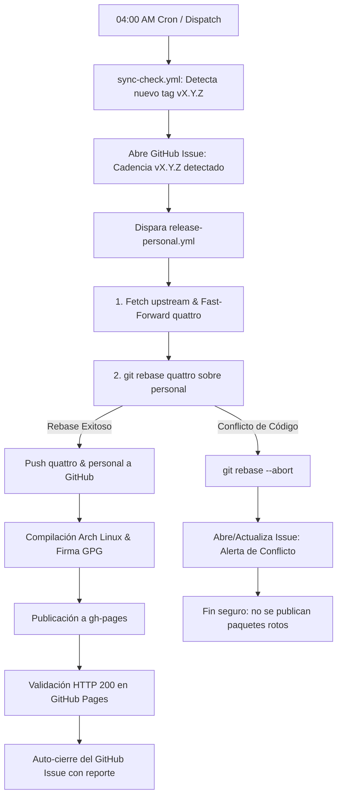

# Cadencia 04:00 AM & Rebase

Para garantizar que el fork personal nunca quede rezagado frente al desarrollo continuo de Omarchy oficial sin requerir que el mantenedor esté pendiente de cada commit, el sistema incorpora un **pipeline de cadencia desatendida (*zero-touch*) a las 04:00 AM**, formalizado en el **ADR-008**.

---

## 1. Diagrama de Flujo del Pipeline

---

## 2. Fases del Flujo Desatendido

### Fase 1: Detección Temprana (`sync-check.yml`)
* Se ejecuta automáticamente a las **04:00 AM (UTC-6)** mediante un cron programado en GitHub Actions de `robert-flo/omarchy-pkgs`.
* Consulta la API de GitHub para obtener el último tag de release en `omacom/omarchy` (ejemplo: `v4.0.4`).
* Compara el tag contra las versiones publicadas en nuestro repositorio pacman `https://robert-flo.github.io/omarchy-personal-repo/`.
* Si detecta una versión más nueva en upstream:
  1. Abre un GitHub Issue de seguimiento titulado: `[Cadencia] Nuevo release upstream detectado: vX.Y.Z`.
  2. Dispara el workflow de empaquetado `release-personal.yml` pasándole el tag como parámetro.

---

### Fase 2: Sincronización y Rebase en el Código Fuente
* El runner de GitHub Actions clona `robert-flo/omarchy` autenticado mediante la deploy key SSH `SSH_OMARCHY_SOURCE_KEY` (con permisos de escritura).
* **Fast-Forward de `quattro`:** Se conecta con `https://github.com/omacom/omarchy.git` y avanza la rama `quattro` directamente al commit upstream, sincronizando también los tags.
* **Rebase de `personal`:** Cambia a la rama `personal` y ejecuta `git rebase quattro`. Esto trasplanta todas nuestras personalizaciones justo encima de la última base de upstream.
* Si el rebase es limpio, hace push seguro (`git push origin quattro` y `git push --force-with-lease origin personal`).

---

### Fase 3: Compilación Containerizada & Firma Criptográfica
* La Action lanza un contenedor Docker con una imagen limpia de Arch Linux.
* Inyecta la clave privada GPG desde los secrets del repositorio en el llavero efímero del contenedor.
* Ejecuta `makepkg` para compilar los paquetes binarios del par sombreado (`pkgrel=99`).
* Firma los archivos `.pkg.tar.zst` y la base de datos `omarchy.db.tar.zst` con la clave RSA 4096-bit.

---

### Fase 4: Publicación en CDN y Verificación de Entrega
* Hace push de los paquetes compilados a la rama `gh-pages` de `robert-flo/omarchy-personal-repo`.
* Espera la propagación de GitHub Pages y ejecuta un sondeo HTTP (`curl -I`) hasta confirmar un código de estado `HTTP 200 OK`.
* Al confirmar la disponibilidad en vivo, el workflow **cierra automáticamente el GitHub Issue de seguimiento** con un reporte detallado que incluye la versión publicada, el hash de los paquetes y el enlace al repositorio.

---

## 3. El Escudo ante Conflictos (*Conflict Containment Shield*)

¿Qué sucede si upstream modificó un archivo que colisiona directamente con nuestras personalizaciones?

Para evitar que el pipeline falle a medias o que se publiquen paquetes inconsistentes, el workflow implementa una barrera de contención estricta:

1. **Detección Inmediata:** Si `git rebase quattro` devuelve un código de salida distinto de cero, el script captura inmediatamente la lista de archivos con conflicto (`git diff --name-only --diff-filter=U`).
2. **Aborto Limpio:** Ejecuta `git rebase --abort` para devolver el repositorio fuente exactamente a su estado previo sin dejar commits huérfanos ni marcas de conflicto en el código.
3. **Alerta Temprana en GitHub Issues:** Crea un issue de alerta urgente titulado:  
   `[Conflicto Rebase] Sincronización de personal requiere intervención manual`.
   En el cuerpo del issue se especifican los archivos en disputa y el bloque exacto de comandos que el mantenedor debe correr en su terminal para resolver la colisión.
4. **Detención Segura:** El workflow finaliza con error (`exit 1`), deteniendo la compilación antes de generar ningún paquete. Tu sistema cliente sigue funcionando sin perturbaciones con la versión anterior hasta que resuelvas la colisión.
