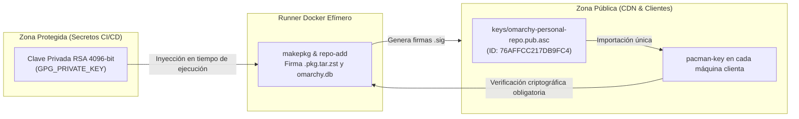

# Modelo de Seguridad GPG

La integridad y autenticidad del software distribuido por el repositorio pacman descansa sobre una infraestructura criptográfica basada en **GnuPG (GPG)**, formalizada en el **ADR-006**.

Esta arquitectura garantiza que ninguna máquina cliente instale paquetes que hayan sido alterados durante el tránsito o generados fuera de nuestro entorno de compilación de confianza.

---

## 1. Principio de Aislamiento de Claves

Para maximizar la seguridad sin comprometer la automatización del CI/CD, se aplica un aislamiento estricto entre el material público y privado:



* **Clave Privada:** Reside **únicamente** en los secretos cifrados de GitHub Actions (`GPG_PRIVATE_KEY` en `robert-flo/omarchy-pkgs`). No se almacena en ningún repositorio git ni en máquinas cliente.
* **Clave Pública:** Es accesible públicamente a través del CDN en `keys/omarchy-personal-repo.pub.asc` para que cualquier máquina la importe una sola vez en su llavero de `pacman-key`.

---

## 2. Metadatos de la Clave Canónica

La clave de firma activa fue generada y rotada siguiendo el procedimiento formal de Disaster Recovery el **2026-09-30**:

| Parámetro | Valor Canónico |
| :--- | :--- |
| **Algoritmo / Longitud** | RSA / 4096 bits |
| **Identificador Corto** | `76AFFCC217DB9FC4` |
| **Identificador Largo** | `A74EB60E76AFFCC217DB9FC4` |
| **Fingerprint Canónico** | `CD92 AB07 B1D2 4DC9 A74E  B60E 76AF FCC2 17DB 9FC4` |
| **Identidad de Usuario** | `Roberto Flores <25asab015@ujmd.edu.sv>` |
| **Validez** | Permanente (sin fecha de expiración para evitar fallos de actualización silenciosos) |

---

## 3. Política de Verificación en Pacman

En `/etc/pacman.conf`, la directiva de seguridad está configurada como:

```ini
[omarchy-personal]
SigLevel = Required DatabaseOptional
Server = https://robert-flo.github.io/omarchy-personal-repo/stable/$arch
```

* **`Required`:** Pacman rechazará terminantemente instalar cualquier paquete `.pkg.tar.zst` cuya firma `.sig` no coincida exactamente con la clave pública de confianza.
* **`DatabaseOptional`:** Permite que la sincronización de la base de datos se ejecute sin fricción mientras se verifica la firma de los paquetes instalados.

---

## 4. Resiliencia y Disaster Recovery (DR)

Si la clave privada llegara a verse comprometida o resultara inaccesible:

1. El mantenedor genera un nuevo par de claves RSA 4096-bit en su máquina de desarrollo.
2. Actualiza el secreto `GPG_PRIVATE_KEY` en `robert-flo/omarchy-pkgs`.
3. Exporta la nueva clave pública a `keys/omarchy-personal-repo.pub.asc` en `robert-flo/omarchy-personal-repo`.
4. El pipeline recompila y refirma todos los paquetes del CDN.
5. Los clientes ejecutan `sudo pacman-key --refresh-keys` o el script de bootstrap para adoptar la nueva clave.
