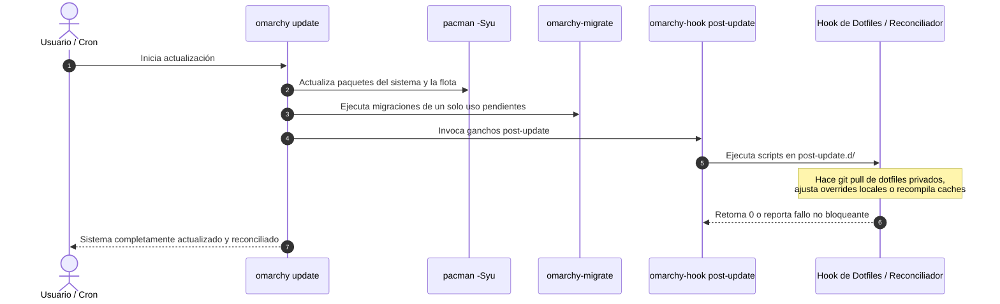

# Arquitectura del Subsistema de Hooks

> **Principio de Diseño:**  
> Los hooks de Omarchy permiten ejecutar lógica arbitraria del usuario o de integraciones locales en respuesta a eventos clave del sistema operativo, **sin modificar el código fuente de la distribución ni requerir privilegios de superusuario**.  
> Funcionan como el mecanismo oficial de extensión y reconciliación continua en `$HOME`.

---

## 1. Topología y Estructura en Disco

El subsistema de hooks se ubica enteramente en el espacio de usuario bajo el directorio:

```text
~/.config/omarchy/hooks/
```

Para cualquier evento denominado `<event>`, el motor busca y ejecuta scripts en dos ubicaciones complementarias:

1. **Archivo individual del evento:**  
   `~/.config/omarchy/hooks/<event>`  
   Si existe y es un archivo ejecutable/legible, se ejecuta pasándole los argumentos del evento.
2. **Directorio modular de extensiones:**  
   `~/.config/omarchy/hooks/<event>.d/*`  
   Si el directorio existe, el motor itera sobre cada archivo presente y lo ejecuta secuencialmente.

### Reglas de Exclusión de Archivos
* **Archivos `.sample`:** Cualquier archivo cuyo nombre termine con la extensión `.sample` (por ejemplo, `sync.sh.sample`) es **ignorado deliberadamente**. Esto permite distribuir ejemplos o plantillas inactivas sin disparar su ejecución.
* **Directorios anidados:** El runner solo ejecuta archivos regulares dentro de `<event>.d/`; no desciende recursivamente.
* **Validación de nombres de eventos:** El runner rechaza cualquier nombre de evento que contenga barras (`/`) o que sea exactamente `.` o `..`, previniendo escapes del directorio de hooks (*directory traversal*).

---

## 2. Eventos Soportados y Puntos de Disparo

Omarchy emite eventos en puntos neurálgicos de su ciclo de vida a través del binario ejecutor `omarchy-hook <event> [args...]`:

| Evento | Quién lo dispara | Argumentos pasados | Momento de ejecución | Casos de uso recomendados |
| :--- | :--- | :--- | :--- | :--- |
| `post-update` | `omarchy-update` | Ninguno | Tras finalizar `pacman -Syu` y `omarchy-migrate` en la terminal de actualización visible | Reconciliación de dotfiles personales (`git pull`), actualización de herramientas no gestionadas por pacman, resync de caches |
| `post-boot` | Hyprland (`autostart.lua`) | Ninguno | 2 segundos después de inicializar la sesión gráfica de Hyprland (`sleep 2 && omarchy-hook post-boot`) | Inicio de daemons de usuario, sincronización de notas en la nube, verificación de estado de la estación de trabajo |
| `pre-refresh-pacman` | `omarchy-refresh-pacman` | Ninguno | Justo antes de refrescar llaves GPG y listas de paquetes de pacman | Configuración de proxies de red, inyección de mirrors privados, validación de certificados |
| `theme-set` | `omarchy-theme-set` | `$1`: Nombre del tema (ej. `catppuccin`, `nord`) | Inmediatamente tras aplicar el nuevo tema en el shell y aplicaciones base | Sincronización de temas en apps de terceros (Slack, Discord, browsers, IDEs sin integración nativa) |
| `font-set` | `omarchy-font-set` | `$1`: Nombre de la tipografía (ej. `JetBrains Mono`) | Inmediatamente tras conmutar la fuente del sistema | Regeneración de caches de fuentes auxiliares, notificación a emuladores de terminal desacoplados |
| `battery-low` | `omarchy-battery-low` | `$1`: Nivel porcentual de batería (ej. `15`) | Cuando el monitor de energía detecta que la batería cae por debajo del umbral de alerta | Activación de perfiles de energía agresivos, cierre seguro de procesos pesados, alertas auditivas locales |

---

## 3. Semántica de Ejecución y Resiliencia No Bloqueante

Uno de los atributos arquitectónicos más críticos del subsistema de hooks es su **resiliencia ante fallos**:

```bash
# Extracto del ejecutor bin/omarchy-hook:
if [[ -f $HOOK_PATH ]]; then
  bash "$HOOK_PATH" "$@" || echo "Hook failed: $HOOK_PATH"
fi

if [[ -d $HOOK_DIR ]]; then
  for hook in "$HOOK_DIR"/*; do
    [[ -f $hook ]] || continue
    [[ $hook == *.sample ]] && continue
    bash "$hook" "$@" || echo "Hook failed: $hook"
  done
fi
```

### Características Clave de la Ejecución:
1. **No bloqueante ante errores (`|| echo "Hook failed: ..."`):**  
   Si un script de hook falla (retorna un código de salida distinto de 0 o arroja un error no controlado), `omarchy-hook` imprime un mensaje de advertencia pero **no aborta el proceso padre**. Por ejemplo, si un hook `post-update` falla durante `omarchy update`, la actualización del sistema continuará con el reinicio de servicios y la notificación final; el sistema no queda en estado roto ni bloqueado.
2. **Entorno de usuario real:**  
   Los hooks siempre se ejecutan en el contexto del usuario regular invocador, heredando su `$HOME`, sus variables de sesión y su `$PATH`.
3. **Paso de parámetros posicionales:**  
   Cualquier argumento pasado a `omarchy-hook <event> arg1 arg2` se reenvía íntegramente a cada script como `$1`, `$2`, etc.

---

## 4. Gestión de Hooks con `omarchy hook install`

Para facilitar la instalación estandarizada de hooks sin lidiar manualmente con rutas ni permisos, Omarchy provee el comando de gestión:

```bash
omarchy hook install <tipo-de-hook> <archivo-script>
```

### Comportamiento del Instalador:
* Valida que `<tipo-de-hook>` no contenga caracteres inválidos ni secuencias de escape.
* Crea automáticamente el directorio de destino `~/.config/omarchy/hooks/<tipo-de-hook>.d/` con `mkdir -p`.
* Copia el `<archivo-script>` preservando su nombre base (`basename`).
* Aplica permisos de ejecución estrictos (`chmod 755`).

### Ejemplo Práctico:
```bash
# 1. Crear un script reconciliador personal
cat <<'EOF' > ~/sync-private-dotfiles.sh
#!/bin/bash
if [[ -d "$HOME/.dotfiles-personal" ]]; then
  git -C "$HOME/.dotfiles-personal" pull --ff-only || true
fi
EOF

# 2. Instalarlo como hook de post-update
omarchy hook install post-update ~/sync-private-dotfiles.sh

# El script queda activo en:
# ~/.config/omarchy/hooks/post-update.d/sync-private-dotfiles.sh
```

### Hooks Instalados Durante el Primer Inicio de Omarchy
En la primera sesión interactiva del usuario (`omarchy-provision-first-run`), el sistema utiliza `omarchy-hook-install post-update` para desplegar tres hooks base provistos por la distribución:
* `install-voxtype.hook` (gestión del modelo de transcripción por voz).
* `setup-fingerprint.hook` (verificación de soporte biométrico).
* `setup-agent.hook` (enlaces para tooling de agentes locales).

---

## 5. Tabla Comparativa: Hook vs. Migración vs. Paquete Pacman

Para evitar el uso inadecuado de herramientas en el ecosistema, la siguiente tabla delimita cuándo utilizar cada mecanismo:

| Criterio | Hook (`hooks/<event>.d/`) | Migración (`migrations/*.sh`) | Paquete Pacman (`omarchy-settings`) |
| :--- | :--- | :--- | :--- |
| **Propósito** | Reconciliación recurrente o respuesta a eventos en `$HOME` | Reparación o transición de estado puntual de un solo uso | Entrega de archivos versionados de la distribución y defaults |
| **Frecuencia** | Múltiples veces (cada vez que ocurre el evento) | **Exactamente una vez** por usuario (o máquina) | En cada instalación o actualización del paquete |
| **Ubicación de fuentes** | `~/.config/omarchy/hooks/` o repo de dotfiles | `migrations/<timestamp>.sh` en el repositorio del fork | `default/`, `etc/xdg/`, `bin/` en el árbol del fork |
| **Registro de estado** | Sin estado persistente (corre de forma idempotente en cada disparo) | `~/.local/state/omarchy/migrations/<timestamp>.sh` | Base de datos local de pacman (`/var/lib/pacman/`) |
| **Manejo de errores** | **No fatal:** El fallo se notifica pero no aborta el flujo | **Fatal:** Si falla, detiene la cola de migraciones y queda pendiente | **Fatal:** Si pacman falla, aborta la transacción |
| **Privilegios** | Usuario regular | Usuario regular (eleva con sudo puntualmente si es requerido) | Root (`pacman`) |
| **Caso típico** | Re-sincronizar dotfiles privados tras `omarchy update` | Mover una ruta antigua de configuración obsoleta a un nuevo formato | Instalar `/etc/xdg/kitty/kitty.conf` o scripts en `/usr/bin/` |

---

## 6. Los Hooks como Reconciliadores Continuos

En arquitecturas de flotas de trabajo, es habitual que cada usuario o máquina mantenga un conjunto de dotfiles privados o personalizaciones que van más allá del núcleo de la distribución.

El subsistema de hooks, específicamente a través del evento `post-update`, actúa como el **reconciliador continuo oficial**:



Al confiar en `post-update.d/` para la reconciliación continua:
1. La distribución permanece limpia y desacoplada de la información privada de cada máquina.
2. No se requiere escribir migraciones artificiales para tareas repetitivas de sincronización.
3. El usuario tiene garantía de que cada vez que el sistema se actualiza con `omarchy update`, sus repositorios privados y reconciliadores locales se ejecutarán de inmediato en la misma sesión.
