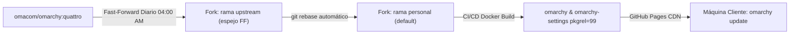

# Introducción & Filosofía

> **La regla de oro del proyecto:**  
> Todo lo que deba llegar a las máquinas del usuario **debe viajar exclusivamente a través de `omarchy update`**.  
> No se admiten scripts sueltos por máquina, no se usan dotfile managers paralelos y no se instalan dependencias manuales.

---

## 1. El Problema que Resolvemos

Personalizar un entorno de escritorio en Linux (especialmente en distribuciones *rolling-release* como Arch Linux y gestores de ventanas como Hyprland) suele derivar en uno de dos extremos indeseables:

1. **Gestores de dotfiles frágiles (`stow`, `chezmoi`, repositorios de dotfiles):**
   * Enlazan o copian archivos sobre `$HOME` sin control de dependencias del sistema.
   * Si una aplicación requiere paquetes de pacman o librerías específicas, el dotfile falla silenciosamente o requiere pasos manuales previos en cada computadora.
   * La sincronización bidireccional genera colisiones y *drift* entre múltiples máquinas.

2. **Bifurcaciones (*hard forks*) desconectadas de upstream:**
   * Modifican el código original pero pierden la capacidad de recibir actualizaciones upstream de manera ágil.
   * El mantenimiento se vuelve una carga pesada y el fork termina abandonado ante la acumulación de cambios incompatibles.

---

## 2. La Filosofía del Fork Personal

Este proyecto implementa una **Tercera Vía**: tratar las personalizaciones como **paquetes nativos de distribución**, integrados de forma armónica sobre el proyecto upstream [`omacom/omarchy`](https://github.com/omacom/omarchy).

### Principios Fundamentales:

* **100% Upstream-Aligned:** El upstream es la fuente de la verdad para el núcleo del sistema. omacom publica en la rama **`quattro`**; nuestro fork mantiene un espejo Fast-Forward 1:1 llamado **`upstream`** (el fetch sigue viniendo de `omacom/omarchy:quattro`; solo cambió el nombre del espejo local, ADR 0024). Nuestras personalizaciones viven en la punta de la historia git dentro de la rama `personal`, que es la rama por defecto de GitHub.
* **Sombreado Parcial sin Fricción:** No recompilamos toda la distribución. Únicamente generamos versiones sombreadas del par fundamental (`omarchy` y `omarchy-settings`) con `pkgrel=99`. Pacman reconoce automáticamente nuestros paquetes como más recientes y los instala sin romper la compatibilidad con el resto del sistema Arch Linux.
* **Cero Configuración Manual por Máquina:** Para dar de alta una nueva laptop o desktop, basta con agregar el repositorio pacman y la llave GPG. De ahí en adelante, cada invocación de `omarchy update` descarga paquetes firmados, siembra configuraciones en `/etc/skel` y ejecuta migraciones idempotentes. Sembrar `/etc/skel` cubre un `$HOME` que todavía no existe: el home nuevo nace de ese skel. Un cambio que debe verse en un `$HOME` ya existente (pc-gracie o una PC hija) solo aplica cuando el paquete trae una migración idempotente y `omarchy update` la ejecuta. `omarchy update` no vuelve a copiar el skel sobre un home que ya existe. Sin esa migración, la edición no está hecha. `default/bash/rc` se carga desde `/usr`, así que un shell nuevo lo ve en cuanto el paquete queda instalado. El stub `default/bashrc` solo actualiza `/etc/skel/.bashrc`; un `~/.bashrc` existente cambia únicamente si una migración lo copia. `~/.local/bin/agy` lo genera `omarchy-mise-install` (paquete `omarchy`). El update instala el generador y no reescribe un wrapper que ya existe; eso también necesita una migración. `omarchy-reinstall-configs` copia todo el skel encima del home y no es el camino de la flota. Un archivo de migración corre una sola vez: cuando la PC lo marca en `~/.local/state/omarchy/migrations/`, `omarchy-migrate` no lo vuelve a ejecutar. No se edita una migración que alguna máquina ya pueda haber corrido. El siguiente cambio a un `$HOME` existente viaja en una migración nueva, con otro timestamp. Hasta que la primera máquina corra `migrations/1791266899.sh`, ese archivo copia el stub que esté instalado al ejecutarse, así que un cambio posterior de `default/bashrc` no necesita una segunda migración si el paquete nuevo llega antes. Cuando la marca ya existe, una migración nueva tiene que volver a copiar el stub. Un cambio en `default/bash/rc` no necesita migración: el stub carga `/usr/share/omarchy/default/bash/rc`. El procedimiento está en [W10](/fork-docs/operations/00-recetas-rapidas/#w10).
* **Automatización Desatendida (*Zero-Touch*):** Diariamente a las 04:00 AM, un pipeline automatizado detecta nuevas versiones de Omarchy, actualiza las ramas, compila en contenedores Docker limpios y publica los paquetes. Si ocurre algún conflicto de código, el sistema se detiene de forma segura y abre un issue de alerta con instrucciones de resolución.

---

## 3. Guía de Lectura de esta Documentación

Este portal está organizado jerárquicamente para responder a cualquier necesidad técnica:

| Sección | Para qué sirve | Cuándo consultarla |
| :--- | :--- | :--- |
| **[Guía de Usuario](/fork-docs/guide/01-introduccion/)** | Aprender a usar el sistema y añadir computadoras. | Al incorporar una máquina nueva o conocer el flujo diario. |
| **[Arquitectura](/fork-docs/architecture/01-topologia/)** | Entender cómo interactúan los 4 repositorios y la Matriz de Decisión. | Antes de realizar cualquier cambio de código o configuración. |
| **[Operaciones](/fork-docs/operations/01-flujo-desarrollo/)** | Flujos de empaquetado, rotación de claves y runbooks. | Para compilar paquetes locales o resolver incidencias. |
| **[ADRs](/fork-docs/adrs/)** | Registro formal de decisiones técnicas (ADR-001 al ADR-009). | Para entender el fundamento histórico y técnico de cada diseño. |
| **[Referencia](/fork-docs/reference/glosario/)** | Glosario de términos y changelog consolidado. | Para aclarar conceptos específicos o auditar cambios. |
