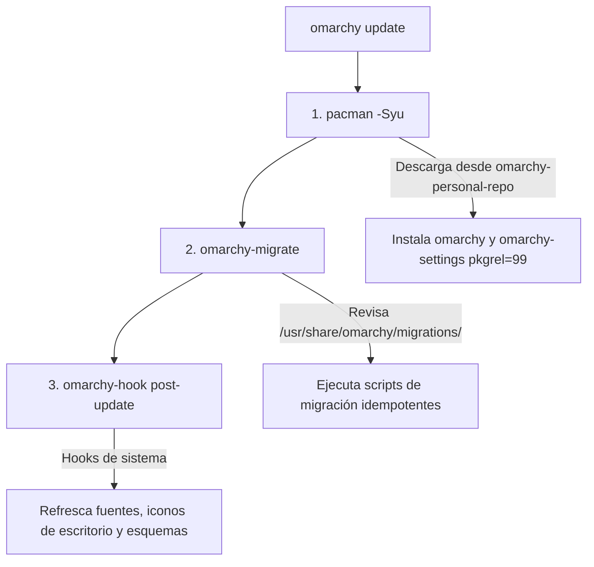

# Uso Diario & Actualizaciones

El principio rector del fork personal es que el usuario final no necesita memorizar flujos complejos ni mantener scripts periféricos. El comando nativo `omarchy update` es la interfaz única para mantener cada máquina al día con las personalizaciones y las novedades upstream.

---

## 1. La Rutina Diaria

Cada mañana, o tras enterarte de un nuevo release upstream, abre una terminal y ejecuta:

```bash
omarchy update
```

No se requieren banderas adicionales ni privilegios `sudo` directos (el propio comando solicitará credenciales cuando invoque a `pacman`).

---

## 2. Anatomía de `omarchy update`

Para entender por qué este mecanismo es tan robusto, conviene analizar qué pasos ejecuta en orden secuencial:



1. **`pacman -Syu`:**  
   Consulta los repositorios configurados. Al encontrar nuestros paquetes en `omarchy-personal-repo` con versión sombreada (`pkgrel=99`), pacman los descarga y los instala sobre los oficiales. Esto coloca los archivos actualizados en `/usr/bin/`, `/usr/share/omarchy/` y `/etc/skel/`.

2. **`omarchy-migrate`:**  
   Examina el directorio `/usr/share/omarchy/migrations/`. Si el paquete incluye una migración con marca de tiempo que aún no está en `~/.local/state/omarchy/migrations/`, la ejecuta en el contexto del usuario y deja ahí la marca con el nombre del archivo. Con la marca puesta, `omarchy-migrate` no la vuelve a correr. No se edita ese archivo. El día a día siguiente va en el archivo de `/usr` que el home ya lee. Una migración nueva es solo otro puente de una vez. Todas las migraciones se diseñan de manera estrictamente idempotente.

3. **`omarchy-hook post-update`:**  
   Ejecuta las rutinas de cierre de actualización: regeneración de bases de datos de escritorio (`update-desktop-database`), refresco de iconos hicolor y reinicio suave de demonios dependientes si es requerido.

---

## 3. ¿Cómo se Reflejan los Cambios en `$HOME`?

Una duda recurrente al gestionar sistemas con paquetes es: *¿por qué al actualizar un paquete no siempre se sobrescribe mi archivo en `$HOME/.config/`?*

Esto es una decisión deliberada de seguridad del diseño de Arch Linux y Omarchy:
* **Usuarios nuevos:** Al crearse un usuario, el sistema copia `/etc/skel` sobre `$HOME`. Por tanto, los usuarios nuevos nacen automáticamente con la última configuración personal. Sembrar `/etc/skel` cubre ese home, el que todavía no existe.
* **Usuarios existentes:** `omarchy update` no vuelve a copiar el skel sobre un `$HOME` que ya existe (pc-gracie o una PC hija). El día a día va en un archivo que ese home ya lee desde `/usr`. `~/.bashrc` se queda como stub y carga `/usr/share/omarchy/default/bash/rc`; los alias y las rutas de Android viven en `default/bash/rc`, y un shell nuevo los ve tras el paquete. `agy` en `~/.local/bin` tiene que ser un stub que hace `exec` de un script en `/usr/share/omarchy/bin`. Una migración nueva es solo el puente de una vez, cuando el home todavía no tiene el stub o hay que reemplazar una vez un archivo generado viejo. `migrations/1791266899.sh` es ese puente. Con la marca en `~/.local/state/omarchy/migrations/`, no se edita. `omarchy-reinstall-configs` no es el camino de la flota. La regla completa está en [Introducción & Filosofía](/fork-docs/guide/01-introduccion/#migracion-home-existente) y el puente se escribe en [W10](/fork-docs/operations/00-recetas-rapidas/#w10). 

Para aplicar cambios a usuarios existentes, la vía depende de si el home ya lee el archivo desde `/usr`:

| Escenario | Vía de Aplicación | Cuándo se usa |
| :--- | :--- | :--- |
| **Día a día** | **Archivo que el home ya lee desde `/usr`** | Alias, rutas de Android, flags. Tras el paquete, un shell nuevo los ve. Sin migración nueva. |
| **Puente de una vez** | **Migración (`migrations/*.sh`)** | El home todavía no tiene el stub, o hay que reemplazar una vez un archivo generado viejo. |
| **Pruebas inmediatas en tu máquina** | **Refresh manual** | Cuando estás probando cambios localmente y deseas forzar la actualización inmediata. |
| **Espacios Herdr** | **`omarchy refresh herdr` con Herdr abierto** | El update instala el comando y la migración de `elio-bin`. Los espacios se arman al refrescar. Ver [Espacios Herdr de la flota](/fork-docs/operations/05-espacios-herdr/). |

### Comandos de Refresh Manual

```bash
# Refresca un archivo de configuración específico desde la fuente instalada
omarchy refresh config kitty/kitty.conf
omarchy refresh config hypr/hyprland.conf
omarchy refresh herdr

# Refresca las aplicaciones de escritorio y wrappers de ~/local/bin
omarchy refresh-applications

# Reinstala el conjunto completo de paquetes base del sistema
omarchy reinstall pkgs
```
