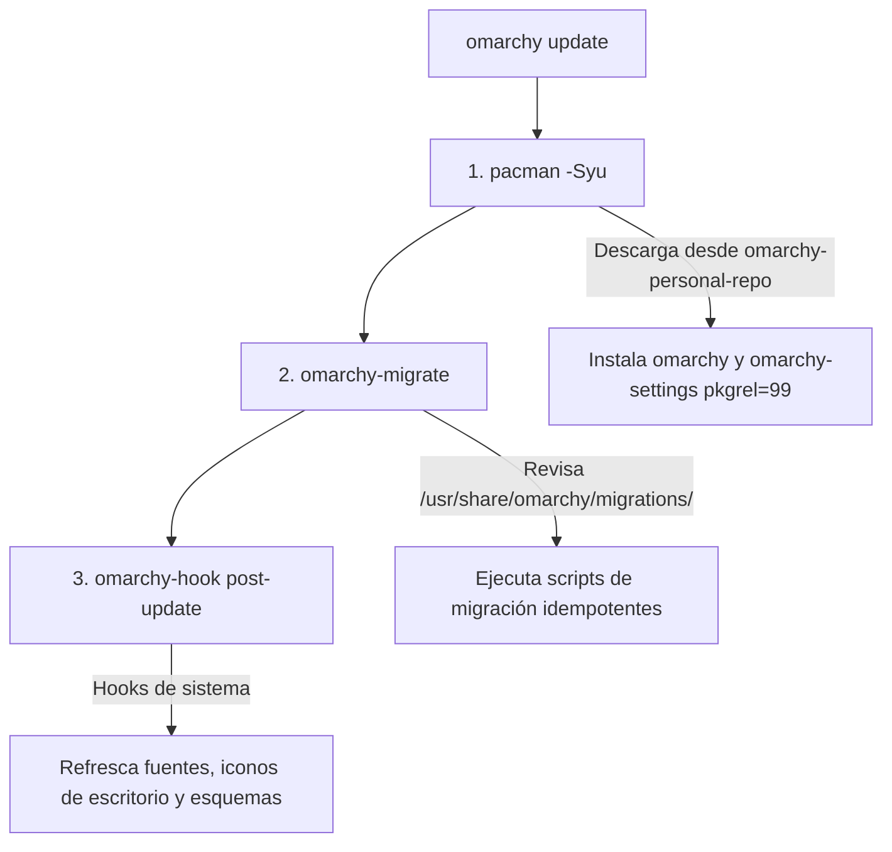

# Uso Diario & Actualizaciones

El principio rector del fork personal es que el usuario final no necesita memorizar flujos complejos ni mantener scripts periféricos. El comando nativo `omarchy update` es la interfaz única para mantener cada máquina al día con las personalizaciones y las novedades upstream.

---

## 1. La Rutina Diaria

Cada mañana, o tras enterarte de un nuevo release upstream, abre una terminal y ejecuta:

```bash
omarchy update
```

No se requieren banderas adicionales ni privilegios `sudo` directos (el propio comando solicitará credenciales cuando invoque a `pacman`).

---

## 2. Anatomía de `omarchy update`

Para entender por qué este mecanismo es tan robusto, conviene analizar qué pasos ejecuta en orden secuencial:



1. **`pacman -Syu`:**  
   Consulta los repositorios configurados. Al encontrar nuestros paquetes en `omarchy-personal-repo` con versión sombreada (`pkgrel=99`), pacman los descarga y los instala sobre los oficiales. Esto coloca los archivos actualizados en `/usr/bin/`, `/usr/share/omarchy/` y `/etc/skel/`.

2. **`omarchy-migrate`:**  
   Examina el directorio `/usr/share/omarchy/migrations/`. Si el paquete incluye una nueva migración con marca de tiempo que aún no se ha registrado en `~/.config/omarchy/migrations.applied`, la ejecuta en el contexto del usuario. Todas las migraciones se diseñan de manera estrictamente idempotente.

3. **`omarchy-hook post-update`:**  
   Ejecuta las rutinas de cierre de actualización: regeneración de bases de datos de escritorio (`update-desktop-database`), refresco de iconos hicolor y reinicio suave de demonios dependientes si es requerido.

---

## 3. ¿Cómo se Reflejan los Cambios en `$HOME`?

Una duda recurrente al gestionar sistemas con paquetes es: *¿por qué al actualizar un paquete no siempre se sobrescribe mi archivo en `$HOME/.config/`?*

Esto es una decisión deliberada de seguridad del diseño de Arch Linux y Omarchy:
* **Usuarios nuevos:** Al crearse un usuario, el sistema copia `/etc/skel` sobre `$HOME`. Por tanto, los usuarios nuevos nacen automáticamente con la última configuración personal.
* **Usuarios existentes:** Para proteger los ajustes que el usuario haya modificado manualmente en su máquina local, `pacman` no destruye archivos de `$HOME`. 

Para aplicar cambios a usuarios existentes, existen dos vías según el escenario:

| Escenario | Vía de Aplicación | Cuándo se usa |
| :--- | :--- | :--- |
| **Distribución a todas las máquinas** | **Migración (`migrations/*.sh`)** | Cuando queremos que el próximo `omarchy update` aplique el cambio automáticamente en todas las computadoras. |
| **Pruebas inmediatas en tu máquina** | **Refresh manual** | Cuando estás probando cambios localmente y deseas forzar la actualización inmediata. |

### Comandos de Refresh Manual

```bash
# Refresca un archivo de configuración específico desde la fuente instalada
omarchy refresh config kitty/kitty.conf
omarchy refresh config hypr/hyprland.conf

# Refresca las aplicaciones de escritorio y wrappers de ~/local/bin
omarchy refresh-applications

# Reinstala el conjunto completo de paquetes base del sistema
omarchy reinstall pkgs
```
