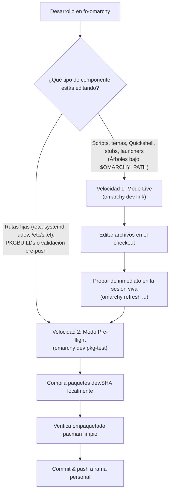

# Ciclo de Desarrollo Local

Cuando estás programando una nueva funcionalidad, ajustando un tema gráfico o creando un comando personalizado en el fork, **no debes publicar paquetes en GitHub ni reconstruir paquetes locales tras cada pequeña edición**.

Para maximizar la agilidad sin sacrificar la rigurosidad, Omarchy establece un **flujo de desarrollo local a dos velocidades**:



---

## 1. Velocidad 1: Modo Live (`omarchy dev link`)

El **Modo Live** permite apuntar la instalación activa de Omarchy directamente al árbol de código fuente local en el que estás trabajando. Cualquier cambio guardado en tus archivos surte efecto de inmediato, sin compilar ni reinstalar ningún paquete pacman.

### Cómo Activar el Modo Live
Ejecuta el comando como tu usuario regular (nunca bajo `sudo`):

```bash
omarchy dev link ~/Work/tries/pj-omarchy/fo-omarchy
```

### Mecanismo Interno y Modificaciones del Sistema
Al ejecutar `omarchy dev link`, el comando realiza dos acciones críticas a nivel de sistema:

1. **Configuración de `$OMARCHY_PATH` (`/etc/omarchy.conf`):**  
   Escribe la variable global en `/etc/omarchy.conf`:
   ```bash
   export OMARCHY_PATH="/home/tanjiro/Work/tries/pj-omarchy/fo-omarchy"
   ```
   Esta variable es leída por el bootstrap de entorno (`default/bash/env-bootstrap`), que se incluye en `/etc/profile.d/omarchy.sh`, `/etc/skel/.bashrc` y `/usr/share/uwsm/env.d/10-omarchy`. Automáticamente antepone `$OMARCHY_PATH/bin` a tu `$PATH`, haciendo que tus ejecutables locales tengan prioridad sobre los de `/usr/bin/`.  
   *(Nota: para que todas las capas del entorno gráfico —Hyprland, barra Quickshell, servicios systemd de usuario— adopten la nueva ruta de forma coordinada, se recomienda reiniciar el sistema tras el linkeo inicial).*

2. **Resolución de privilegios en `sudo` (`/etc/sudoers.d/omarchy-dev-path`):**  
   `sudo` por seguridad ignora el `$PATH` del usuario y resuelve binarios únicamente contra `secure_path`. Para evitar que un comando ejecutado con `sudo omarchy-*` invoque la versión empaquetada vieja de `/usr/bin/`, `omarchy dev link` genera una regla segura en `/etc/sudoers.d/omarchy-dev-path`:
   ```text
   Defaults secure_path="/home/tanjiro/Work/tries/pj-omarchy/fo-omarchy/bin:/usr/local/sbin:/usr/local/bin:/usr/bin"
   ```
   Este archivo se valida estrictamente con `visudo -cf` antes de instalarse. **Toma efecto de inmediato sin reiniciar**, permitiendo que las llamadas privilegiadas a tus scripts de desarrollo se ejecuten directamente desde tu checkout.

### Comandos de Inspección y Retorno
* **Consultar el estado del link:**
  ```bash
  omarchy dev status
  # Muestra: "dev-link: configured" junto a la rama activa
  ```
* **Consultar la rama git activa en el link:**
  ```bash
  omarchy version branch
  ```
* **Desactivar el Modo Live (Regresar a producción):**
  ```bash
  omarchy dev unlink
  # Elimina /etc/sudoers.d/omarchy-dev-path y restablece OMARCHY_PATH al paquete empaquetado
  ```

---

## 2. Velocidad 2: Modo Pre-flight (`omarchy dev pkg-test`)

El **Modo Pre-flight** construye e instala localmente paquetes Arch provisionales marcados como `dev.<commit-sha>` a partir de los PKGBUILDs de la distribución.

Se utiliza como **filtro de calidad previo al push** y es estrictamente obligatorio para validar componentes que no residen bajo `$OMARCHY_PATH`.

### Cómo Ejecutar el Modo Pre-flight
```bash
# Compilar e instalar ambos paquetes (omarchy-dev y omarchy-settings-dev):
omarchy dev pkg-test

# O compilar únicamente el paquete de configuraciones:
omarchy dev pkg-test omarchy-settings-dev
```

### Características de los Paquetes Generados:
* Se compilan en un directorio temporal (`/tmp/omarchy-dev-pkg-test.XXXXXX`).
* El campo `pkgver` se marca automáticamente con `dev.<commit-sha>[.dirty]`. Al consultar `pacman -Q omarchy`, es inmediatamente evidente que el paquete proviene de una prueba local.
* No se publica ningún archivo en repositorios remotos ni se altera el canal de producción.

---

## 3. Delimitación Estricta: ¿Cuándo Usar Cada Velocidad?

La siguiente matriz delimita con exactitud qué herramienta utilizar según el componente que estés modificando:

| Componente a Modificar | Ruta en el Repositorio | ¿Cubre `dev link`? | ¿Requiere `pkg-test`? | Justificación Técnica |
| :--- | :--- | :---: | :---: | :--- |
| **Comandos y scripts de sistema** | `bin/omarchy-*` | **Sí** | Opcional (pre-push) | Resuelto por `$OMARCHY_PATH/bin` y `secure_path` en sudo. |
| **Configuraciones base y stubs** | `default/<app>/`, `config/` | **Sí** | Opcional (pre-push) | Rutas referenciadas directamente vía `$OMARCHY_PATH`. |
| **Temas visuales y paletas** | `themes/<nombre>/`, `default/themed/` | **Sí** | Opcional (pre-push) | `omarchy theme set` lee directamente desde `$OMARCHY_PATH/themes`. |
| **Widgets de Quickshell / Barra** | `shell/` | **Sí** | Opcional (pre-push) | Quickshell carga el runtime desde `$OMARCHY_PATH/shell`. |
| **Lanzadores de aplicaciones** | `applications/*.desktop` | **Sí** | Opcional (pre-push) | `omarchy refresh-applications` lee desde `$OMARCHY_PATH/applications`. |
| **Archivos en `/etc/`** | `etc/` (drop-ins, faillock, xdg) | **No** | **Obligatorio** | Rutas fijas del sistema operativo fuera del árbol `$OMARCHY_PATH`. |
| **Servicios y unidades systemd** | `default/*.service` -> `/usr/lib/systemd/` | **No** | **Obligatorio** | Systemd requiere los archivos físicos instalados en `/usr/lib/systemd/system/` o `user/`. |
| **Reglas de hardware udev** | `install/hardware/udev/` | **No** | **Obligatorio** | Udev lee únicamente desde `/usr/lib/udev/rules.d/` o `/etc/udev/rules.d/`. |
| **Semillas de usuario (`/etc/skel/`)** | Archivos copiados a `$pkgdir/etc/skel/` | **No** | **Obligatorio** | `/etc/skel/` requiere que el paquete instale físicamente los archivos para nuevos usuarios. |
| **Temas de arranque Plymouth / SDDM** | Temas instalados en `/usr/share/` | Parcial | **Obligatorio** | Aunque `omarchy plymouth set` autoriza recargas locales, la validación final del paquete exige verificar los archivos en `/usr/share/plymouth/`. |
| **Cambios en PKGBUILD o dependencias** | `fo-omarchy-pkgs/pkgbuilds/` | **No** | **Obligatorio** | Valida sintaxis de empaquetado, dependencias pacman y hooks de instalación. |

---

## 4. El Bucle Completo de Trabajo del Desarrollador

Un ciclo de desarrollo profesional en el fork combina ambas velocidades:

```text
[1. Activar Live]       omarchy dev link ~/Work/tries/pj-omarchy/fo-omarchy
                              ↓
[2. Iterar en caliente] Editar scripts / configs / QML
                        Probar con: omarchy refresh config / omarchy refresh hyprland
                              ↓
[3. Pre-flight Check]   omarchy dev pkg-test (valida que el empaquetado sea limpio)
                              ↓
[4. Commit y Push]      git commit & git push origin personal
                              ↓
[5. Publicar en CI]     gh workflow run release-personal.yml -R robert-flo/omarchy-pkgs
                              ↓
[6. Desvincular DEV]    omarchy dev unlink
                        omarchy update (máquina vuelve al paquete firmado del repo)
```

Al seguir este bucle:
* Ahorras tiempo iterando en tiempo real con `dev link`.
* Garantizas que ningún error de empaquetado o ruta fija rota llegue a GitHub gracias a `pkg-test`.
* Mantienes tu estación de trabajo limpia y alineada con la flota.

---

## 5. El Flujo Integral de Validación con Migraciones de Estado

Cuando tu cambio en el fork introduce una **migración de estado** (`migrations/<timestamp>.sh`) o requiere que una máquina existente ejecute lógica de aprovisionamiento antes de que los componentes vivos tomen efecto, el bucle en DEV debe seguir una secuencia estricta de 4 pasos:

```bash
cd ~/Work/tries/pj-omarchy/fo-omarchy
omarchy dev pkg-test
omarchy-migrate
omarchy refresh <componente>
```

### Anatomía Técnica de la Secuencia:

1. **`cd ~/Work/tries/pj-omarchy/fo-omarchy` (o tu checkout local):**  
   Te sitúa en la raíz del árbol de fuentes del fork (rama `personal`) para que las herramientas de desarrollo detecten el repositorio correcto.
2. **`omarchy dev pkg-test`:**  
   Compila localmente e instala los paquetes provisionales `omarchy-dev` y `omarchy-settings-dev` (etiquetados como `dev.<commit-sha>`). Esto deposita el nuevo script de migración en `/usr/share/omarchy/migrations/` y actualiza los binarios del sistema.
3. **`omarchy-migrate`:**  
   Examina `/usr/share/omarchy/migrations/`, detecta los scripts que aún no tienen marca en `~/.local/state/omarchy/migrations/` y los ejecuta en el contexto de tu usuario en `gracie`. Sin este paso, el script de migración recién instalado queda inactivo en disco sin ejecutarse.
4. **`omarchy refresh <componente>`:**  
   Fuerza la recarga o reconciliación inmediata del componente en caliente (`config <relpath>`, `applications`, `hyprland`, `herdr`, etc.) para verificar visual y funcionalmente que el estado final del escritorio es el esperado.

> **Regla de Oro:**  
> Si tu cambio **no** agrega ni modifica ningún archivo bajo `migrations/`, el paso 3 (`omarchy-migrate`) no realiza ninguna acción. En ese caso, para cambios que admiten el Modo Live, basta con usar `omarchy dev link` y recargar directamente con `omarchy refresh`.
