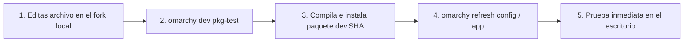

# Ciclo de Desarrollo Local

Cuando estás programando una nueva funcionalidad, ajustando un tema gráfico o creando un comando personalizado, **no debes publicar paquetes en GitHub tras cada pequeña edición**.

Para iterar de forma rápida y segura, Omarchy cuenta con el **Escenario DEV**, gobernado por el comando `omarchy dev pkg-test`.

---

## 1. El Bucle de Desarrollo Iterativo

```text
Editar código en el fork  →  omarchy dev pkg-test  →  omarchy refresh <componente>  →  Validar visualmente
```



### Paso 1: Edición en el Fork
Realiza las modificaciones necesarias en el clon local de `robert-flo/omarchy` (rama `personal`).  
Ejemplo: modificas `config/hypr/hyprland.conf` para cambiar los bordes de las ventanas.

### Paso 2: Compilación de Prueba (`omarchy dev pkg-test`)
Ejecuta en la terminal de tu máquina dev:

```bash
omarchy dev pkg-test
```

¿Qué hace este comando?
* Empaqueta localmente uno o ambos paquetes (`omarchy-dev`, `omarchy-settings-dev`) directamente desde tu árbol de trabajo git actual.
* Etiqueta la versión como `dev.<commit-sha>` para que sepas en todo momento de qué commit provienen los archivos instalados.
* **No sube ningún archivo a GitHub ni altera el CDN de producción**.

### Paso 3: Refrescar el Componente
Para que los archivos instalados en `/usr/share/` o `/etc/skel/` se reflejen en tu `$HOME` de usuario:

```bash
# Si tocaste un archivo de configuración de usuario:
omarchy refresh config hypr/hyprland.conf

# Si tocaste un lanzador de escritorio o wrapper de mise:
omarchy refresh-applications

# Si modificaste la barra o el gestor de ventanas:
omarchy refresh hyprland
```

### Paso 4: Validar
Comprueba que el comportamiento en tu escritorio es exactamente el esperado. Si algo falla, vuelve a editar el archivo y repite el bucle.

---

## 2. Promoción a Producción (Escenario MÁQUINAS)

Una vez que tu cambio está 100% probado y listo para distribuirse a todas tus computadoras:

1. **Haz commit y push a la rama `personal`:**
   ```bash
   git add config/hypr/hyprland.conf
   git commit -m "feat(hypr): bordes redondeados y nuevas sombras"
   git push origin personal
   ```

2. **Publica el nuevo paquete en GitHub Actions:**
   ```bash
   gh workflow run release-personal.yml -R robert-flo/omarchy-pkgs \
     --ref personal -f version=v4.0.4
   ```

3. **Verifica y actualiza:**
   Cuando la Action finalice en verde, ejecuta en cualquier máquina:
   ```bash
   omarchy update
   ```
