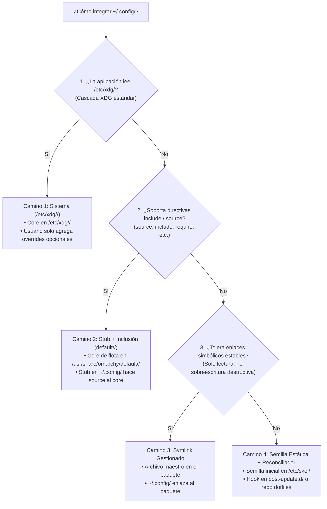

# Añadir Configuraciones de App a la Flota

> **Guía Operativa para Desarrolladores y Agentes:**  
> Cuando se solicita integrar una nueva aplicación o personalizar su configuración en el ecosistema Omarchy (`~/.config/<app>/`), **está terminantemente prohibido copiar dotfiles a mano o inventar migraciones innecesarias**.  
> Sigue rigurosamente este procedimiento para enrutar la implementación por el camino arquitectónico correcto.

---

## 1. Cuestionario de Evaluación y Árbol de Decisión

Antes de crear un solo archivo en el fork, evalúa las capacidades técnicas de la aplicación respondiendo las siguientes cuatro preguntas en orden estricto:



### Regla de Oro de Selección:
**Elige siempre el camino más alto posible en el árbol.** Si la aplicación soporta XDG a nivel de sistema (Camino 1), jamás implementes stubs (Camino 2) ni semillas en `$HOME` (Camino 4).

---

## 2. Recetas Paso a Paso por Camino

### Camino 1: Configuración de Sistema (`/etc/xdg/<app>/`)
* **Ideal para:** Aplicaciones que cumplen la XDG Base Directory Specification (ej. Kitty, Fastfetch).
* **Flujo en el repositorio `fo-omarchy`:**
  1. Crea la configuración por defecto de la flota bajo `etc/xdg/<app>/`:
     ```text
     fo-omarchy/etc/xdg/<app>/config
     ```
  2. En el PKGBUILD de `omarchy-settings`, asegúrate de que se instale en `/etc/xdg/<app>/config`.
* **Comportamiento en la máquina del usuario:**
  * La aplicación lee automáticamente `/etc/xdg/<app>/config` al arrancar.
  * Si el usuario no necesita cambios personales, **no se crea ningún archivo en `$HOME/.config/<app>/`**.
  * Si el usuario desea personalizar, crea `$HOME/.config/<app>/config` conteniendo únicamente sus *overrides*.
* **Actualización en la flota:** Cada `omarchy update` actualiza `/etc/xdg/<app>/config` vía pacman sin tocar `$HOME`.

---

### Camino 2: Stub de Usuario + Inclusión (`default/<app>/`)
* **Ideal para:** Aplicaciones que no leen `/etc/xdg/` pero soportan directivas de inclusión (ej. Hyprland `source = ...`, Foot `include=...`, Bash `source ...`, Tmux `source-file ...`).
* **Flujo en el repositorio `fo-omarchy`:**
  1. **Crear el núcleo de la flota:**
     Crea el archivo central con los defaults gestionados por la distribución en `default/<app>/`:
     ```text
     fo-omarchy/default/<app>/omarchy-defaults.conf
     ```
     *(Se instala en `/usr/share/omarchy/default/<app>/omarchy-defaults.conf` vía `omarchy-settings`).*
  2. **Crear la plantilla de stub para nuevos usuarios:**
     Ubica en `default/<app>/` o `/etc/skel/.config/<app>/` la plantilla que hereda el núcleo:
     ```text
     # ~/.config/<app>/config (Stub generado)
     # Core gestionado por la flota Omarchy:
     include /usr/share/omarchy/default/<app>/omarchy-defaults.conf

     # ==========================================
     # Overrides y personalizaciones del usuario:
     # ==========================================
     ```
  3. **Puente para usuarios existentes (si aplica):**
     Si la aplicación ya existía en la flota y requiere materializar el stub en usuarios que no lo tienen, genera una migración de inicialización única (`migrations/<timestamp>.sh`):
     ```bash
     echo "Sembrar stub de configuración para <app>"
     cfg="$HOME/.config/<app>/config"
     if [[ ! -f "$cfg" ]]; then
       mkdir -p "$(dirname "$cfg")"
       cat <<'EOF' > "$cfg"
     include /usr/share/omarchy/default/<app>/omarchy-defaults.conf
     EOF
     fi
     ```
* **Actualización en la flota:** Cualquier mejora a la configuración de la flota se hace en `default/<app>/omarchy-defaults.conf`. `omarchy update` actualiza el archivo en `/usr/share/omarchy/` y todos los usuarios se benefician al instante sin tocar sus archivos locales.

---

### Camino 3: Enlace Simbólico Gestionado (Symlink)
* **Ideal para:** Archivos modulares, temas o plugins que la app lee pero no reescribe al cerrarse (ej. temas de Neovim, definiciones de plugins de agentes en `~/.agents/skills/`).
* **Flujo en el repositorio `fo-omarchy`:**
  1. Guarda el archivo o directorio maestro en el paquete:
     ```text
     fo-omarchy/default/<app>/recurso
     ```
  2. Materializa el symlink en tiempo de aprovisionamiento de usuario (`bin/omarchy-provision-user`):
     ```bash
     mkdir -p "$HOME/.config/<app>"
     ln -sfn "/usr/share/omarchy/default/<app>/recurso" "$HOME/.config/<app>/recurso"
     ```
* **Actualización en la flota:** `omarchy update` reemplaza el archivo en `/usr/share/omarchy/` y el symlink refleja la nueva versión inmediatamente.

---

### Camino 4: Semilla Estática (`/etc/skel/`) + Reconciliador Continuo
* **Ideal para:** Aplicaciones con formatos monolíticos o herramientas con interfaz gráfica que guardan estado pisando el archivo completo (ej. JSON/INI sobrescritos).
* **Flujo en el repositorio `fo-omarchy`:**
  1. **Semilla para onboarding:**
     Ubica la configuración inicial en `default/<app>/` instalada en `$pkgdir/etc/skel/.config/<app>/config`. Los nuevos usuarios recibirán esta semilla al crearse la cuenta.
  2. **Reconciliador recurrente (si la flota necesita sincronizar cambios continuos):**
     Crea un hook de ciclo de vida en `~/.config/omarchy/hooks/post-update.d/reconcile-<app>.sh`:
     ```bash
     #!/bin/bash
     # Reconciliación no destructiva de llaves específicas
     cfg="$HOME/.config/<app>/config.json"
     if [[ -f "$cfg" ]] && command -v jq &>/dev/null; then
       tmp=$(mktemp)
       jq '.fleet_setting = "valor_estandar"' "$cfg" > "$tmp" && mv "$tmp" "$cfg"
     fi
     ```
  3. **Corrección puntual crítica (solo si hay rotura de versión):**
     Si un cambio de versión de la app rompe configuraciones viejas, genera una migración de un solo uso con `omarchy dev add-migration` para parchar el archivo de forma quirúrgica e idempotente.

---

## 3. Validación y Prueba en DEV

Antes de abrir un PR o hacer commit de la nueva configuración:

```bash
# 1. Enlazar en Modo Live para iteración rápida:
omarchy dev link ~/Work/tries/pj-omarchy/fo-omarchy

# 2. Refrescar la configuración local para probar la plantilla:
omarchy refresh config <app>/config

# 3. Validar pre-flight (obligatorio si tocaste /etc/xdg o /etc/skel):
omarchy dev pkg-test omarchy-settings-dev

# 4. Probar la aplicación en tu sesión viva:
<app> --check / abrir la app en Hyprland
```

---

## 4. Checklist de Entrega para Agentes y Desarrolladores

Antes de marcar una tarea de configuración de aplicación como lista, verifica cada casilla:

- [ ] **Evaluación de capacidades:** ¿Se analizó si la app soporta `/etc/xdg/` o directivas `include`/`source` antes de optar por semillas en `$HOME`?
- [ ] **Cero sobreescritura arbitraria:** ¿Se evitó asumir que `omarchy update` sobreescribe `$HOME` de usuarios existentes?
- [ ] **Desacoplamiento de Overrides:** ¿El usuario local puede añadir sus propias configuraciones sin perder las actualizaciones de la flota?
- [ ] **Sin migraciones innecesarias:** ¿Se evitó crear una migración de un solo uso para sincronizaciones periódicas (usando en su lugar hooks en `post-update.d/`)?
- [ ] **Pruebas en dos velocidades:** ¿Se probó la plantilla en caliente con `dev link` y se validó el empaquetado pacman limpio con `pkg-test`?
